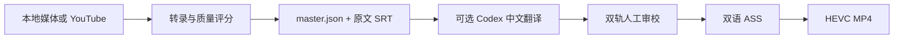

# CueFlow

[English summary](README.en.md) | **简体中文（主文档）**


CueFlow 把视频或音频变成可追溯的字幕项目：本地转录、可选词级对齐、稳定 ID 翻译、双轨人工审校、双语 ASS 排版和 HEVC VideoToolbox 压制。`master.json` 保存字幕段、时间轴和转录元数据；SRT、ASS 与 MP4 是交换或交付产物。

## 当前状态与边界

- **规模**：中型单机应用。仓库是一个 Python 包，但同时包含 CLI、本地 Web UI、ASR 编排、翻译、审校、排版、视频编码和测试。
- **声明版本**：`0.4.0`，`pyproject.toml` 将成熟度标为 Alpha。当前公开 Git 历史从经过审查的代码快照开始，且没有 tag；更早的版本演进、正式发布日期和发布边界无法从本仓库确认。
- **平台**：主要面向 Apple Silicon macOS。`pyproject.toml` 声明 Python `>=3.11`；CI 覆盖 Python 3.11、3.12 和 3.13，建议本地优先使用 3.11。
- **运行方式**：本地 CLI 或仅绑定回环地址的本地网页；不是多用户服务，不得通过反向代理或公网隧道暴露。
- **数据边界**：视频、音频、ASR、WhisperX、ASS 和 FFmpeg 编码留在本机。主动使用 Codex 翻译时，请求包含字幕文本、稳定 ID、起止时间、源语言和所选模型；不会上传视频或音频。
- **验证状态**：当前公开基线在 Python 3.11 和 3.12 上各有 51/51 项单元测试通过；wheel 可在 Python 3.11 构建。仓库所有者已确认完成真实媒体的 ASR、翻译、烧录、清理和 Apple VideoToolbox 人工验收，但详细证据尚未进入 Git。详见 [测试指南](docs/TESTING.md)。

CueFlow 不保证 ASR 或翻译语义完全正确，最终字幕和成片必须人工审校。

## 工作流



本地媒体默认使用外部 FrameLedger MLX Whisper helper；高级路径可先用 VAD 生成语音窗，以 Turbo 转录，并对低置信度窗口尝试 full large-v3。`auto` 对齐模式在 WhisperX 可用时执行词级对齐，否则保留 MLX 词时间并给出警告。

## 安装

### 1. 系统依赖

```bash
brew install python@3.11 ffmpeg-full
```

`ffmpeg-full` 必须包含 libass 的 `ass` filter；视频压制还需要同目录或 `PATH` 中可用的 `ffprobe`，Apple 硬件编码需要 `hevc_videotoolbox`。`yt-dlp` 会随 CueFlow 的 Python 基础依赖安装。

### 2. Python 环境

```bash
git clone https://github.com/ericchiu-ca/cueflow.git
cd cueflow
python3.11 -m venv .venv
source .venv/bin/activate
python -m pip install --upgrade pip
python -m pip install -e ".[asr]"
```

`.[asr]` 包含 YouTube 无字幕时使用的可选 `faster-whisper` fallback。仓库没有 lockfile，安装会按约束解析当时可用版本，不能视为字节级可复现环境。

### 3. 可选 WhisperX 环境

```bash
python3.11 -m venv .venv-whisperx
.venv-whisperx/bin/python -m pip install -r requirements-whisperx.txt
```

`requirements-whisperx.txt` 当前固定为 `whisperx==3.8.6`。它与主环境分开，避免 ML 依赖冲突。

## 配置

最稳妥的方式是在命令行显式传入本地资源：

```bash
cueflow web \
  --host 127.0.0.1 \
  --port 8765 \
  --output projects/local \
  --model-path /path/to/whisper-large-v3-turbo \
  --mlx-helper /path/to/frameledger-asr-helper \
  --whisperx-python /path/to/whisperx/python \
  --no-open
```

也可以使用以下环境变量：

| 变量 | 实际用途 |
| --- | --- |
| `SUBFLOW_MLX_MODEL` | Turbo MLX 模型目录 |
| `SUBFLOW_MLX_LARGE_MODEL` | full large-v3 MLX 模型目录 |
| `SUBFLOW_MLX_HELPER` | FrameLedger MLX helper 可执行文件 |
| `SUBFLOW_WHISPERX_PYTHON` | 安装了 WhisperX 的 Python 可执行文件 |
| `SUBFLOW_FFMPEG` | 可运行且具备所需 filter/encoder 的 FFmpeg |
| `SUBFLOW_CODEX` | Codex CLI 可执行文件 |

默认资源路径由当前用户的 home 目录推导到 `~/Documents/FrameLedger/...`。网页环境状态和实际转录现在统一读取 `SUBFLOW_MLX_MODEL`；显式 `--model-path` 仍具有优先级。

使用 Codex 翻译前：

```bash
codex login
codex login status
```

Codex CLI 的登录方式、模型可用性和账户用量由 OpenAI 当前产品与账户策略决定；参见官方 [Authentication](https://learn.chatgpt.com/docs/auth) 和 [Models](https://learn.chatgpt.com/docs/models) 文档。

## 最小运行示例

先确认安装和命令入口：

```bash
cueflow --help
cueflow web --host 127.0.0.1 --port 8765 --no-open
```

然后打开 <http://127.0.0.1:8765/>。服务会为每个进程生成 CSRF token，所有改变状态的请求必须携带该 token。

常用 CLI：

```bash
# YouTube：优先人工英文字幕，其次自动字幕，最后可选 faster-whisper
cueflow prepare "YOUTUBE_URL" --output projects/example

# 本地媒体转录
cueflow transcribe-file input.mp4 \
  --output projects/local/example \
  --language en \
  --alignment auto \
  --model-path /path/to/whisper-large-v3-turbo \
  --mlx-helper /path/to/frameledger-asr-helper

# 将已有英文或加拿大法语 SRT 翻译为简体中文
cueflow translate-srt en.srt \
  --output projects/local/translation \
  --language en \
  --model gpt-5.6-terra

# 稳定 ID 手工翻译工作流
cueflow import-translation projects/example/translation_zh.txt
cueflow build projects/example
cueflow qc projects/example

# 双语 ASS 与视频压制
cueflow build-ass en.srt zh.srt --output output/bilingual.ass
cueflow burn input.mp4 output/bilingual.ass \
  --output output/input.bilingual.mp4 \
  --profile hevc-source
```

完整子命令以 `cueflow --help` 和 `cueflow <子命令> --help` 为准。

## 目录结构

```text
.
├── subflow/                    # Python 包
│   ├── cli.py                  # CLI 入口与子命令
│   ├── core.py                 # SRT、稳定 ID、master.json 基础模型
│   ├── transcription.py        # 本地转录与 WhisperX 对齐编排
│   ├── advanced_asr.py         # VAD、双模型重试与置信度评分
│   ├── translation.py          # Codex 翻译边界与结果校验
│   ├── review.py               # 人工审校数据校验
│   ├── bilingual.py            # ASS、预览与视频压制
│   ├── web.py                  # 回环 HTTP 服务与任务生命周期
│   ├── static/index.html       # 单页本地 UI
│   └── schemas/                # 翻译结果 JSON Schema
├── tests/                      # unittest 测试
├── assets/fonts/               # 内置字体、许可证和修改说明
├── docs/                       # 架构、测试、发布和历史审计
├── pyproject.toml              # 包元数据与主要依赖声明
├── requirements.txt            # 兼容性安装清单
└── requirements-whisperx.txt   # 独立 WhisperX 环境
```

网页产物默认写入 `projects/local/` 下的六个受管类别：`transcriptions/`、`translations/`、`reviews/`、`bilingual/`、`ass-assets/` 和 `renders/`。清理操作只删除这些类别，但删除后不可由应用恢复，应先下载所需结果。

## 测试

```bash
python3.11 -m unittest discover -s tests -v
python3.11 -m pip wheel . --no-deps --no-build-isolation -w dist
git diff --check
```

当前纯 Python 测试已全绿，真实媒体链路也已由仓库所有者确认完成；发布前仍应按 [docs/TESTING.md](docs/TESTING.md) 补齐可审计的版本、输入 hash、命令和产物记录。

## 已知限制

- `master.json` 没有显式 schema version，也没有源媒体 hash；跨版本兼容和输入同一性不能自动证明。
- 新生成的转录 `master.json` 只保存模型目录 basename，并递归清理元数据字符串中的绝对本机路径；它仍会保存源媒体 basename、字幕和质量信息，分享前仍需检查内容敏感性。
- `pyproject.toml` 与 `requirements.txt` 已统一 `yt-dlp>=2024.1`，但仓库仍没有统一 lockfile。
- 网页任务队列只存在于当前进程，重启后不能继续轮询旧任务。
- 大型 SRT 没有自动分批和断点续译，可能超过模型上下文窗口。
- WhisperX 只改善时间边界，不保证修复识别文本。
- 双语轨按顺序配对，不执行语义对齐；段落数必须一致。
- 竖屏视频没有独立版式；输出固定为 SDR `yuv420p`，不保留 HDR 元数据或色调映射。
- 真实 YouTube、MLX、WhisperX、Codex、FFmpeg 和硬件编码路径不在 CI 中执行。

## 文档入口

- [CHANGELOG.md](CHANGELOG.md)：按可验证 commit 回填的变化记录与 `Unreleased` 区域。
- [docs/ARCHITECTURE.md](docs/ARCHITECTURE.md)：模块边界、数据流、外部依赖、环境差异与技术债务。
- [docs/TESTING.md](docs/TESTING.md)：测试类型、命令、CI 范围、当前结果与人工验证。
- [docs/VERSIONING_AND_RELEASES.md](docs/VERSIONING_AND_RELEASES.md)：版本、tag、发布、复现与回滚规则。
- [docs/CODE_AUDIT.md](docs/CODE_AUDIT.md)：2026-08-25 的历史代码审计，不代表当前持续审计结果。
- [SECURITY.md](SECURITY.md)：安全支持范围、数据边界和漏洞报告方式。
- [CONTRIBUTING.md](CONTRIBUTING.md)：开发环境、修改原则、测试与提交审查清单。

## 许可证

仓库当前包含 [MIT License](LICENSE)。内置 CueFlow Han Sans SC、Mulish 和 Inter 字体的许可证及修改说明位于 `assets/fonts/`；发布前仍应由仓库所有者确认代码、字体二进制和所有拟发布素材的权利链。
