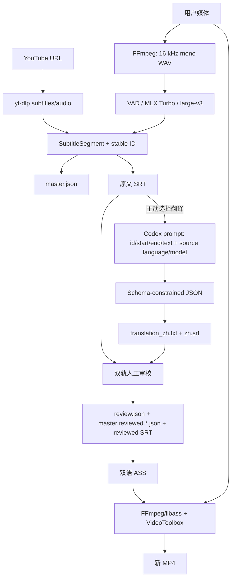

# CueFlow 架构

本文描述当前公开仓库中的代码基线。它是现状说明，不是未来设计承诺；具体版本边界以未来 tag 和对应 commit 为准。

## 项目规模与架构形态

CueFlow 属于**中型单机应用**：代码位于一个 Python package 中，没有数据库、容器或云端服务，但同时承担 CLI、本地 HTTP UI、后台任务、ML/媒体外部进程编排、结构化字幕数据和视频交付。当前规模不需要 Monorepo 或大量 ADR；重要的新决策应在引入破坏性数据格式、外部服务或发布机制时再建立 `docs/adr/`。

架构原则：

- `master.json` 保存转录项目的结构化字幕段和元数据；SRT/ASS/MP4 是派生或交换产物。
- 媒体处理本地优先，唯一现有云边界是用户主动触发的 Codex 字幕翻译。
- 本地网页只绑定 loopback，不提供远程用户认证。
- 外部模型、helper 和媒体工具不复制进仓库，通过路径或独立环境接入。
- 原始 SRT/媒体不应被审校或压制步骤原地覆盖；新结果写入独立项目目录。

## 当前技术栈

| 层 | 当前实现 | 版本或约束来源 |
| --- | --- | --- |
| 语言与运行时 | Python | `pyproject.toml` 声明 `>=3.11`；CI 为 3.11/3.13；没有上限 |
| 构建 | setuptools + wheel | `[build-system]`：`setuptools>=77`、`wheel` |
| CLI | `argparse`，console script `cueflow` | Python 标准库、`pyproject.toml` |
| Web 服务 | `http.server.ThreadingHTTPServer` + 单文件 HTML/CSS/JS | Python 标准库、`subflow/static/index.html` |
| YouTube | `yt-dlp` 外部命令 | manifest 与 `requirements.txt` 均为 `>=2024.1` |
| ASR fallback | `faster-whisper` | 可选依赖 `>=1.2.0` |
| 主本地 ASR | FrameLedger MLX Whisper model/helper | 仓库外资源；精确 MLX package 版本无法从本仓库确认 |
| 语音窗与高级 ASR | Pyannote/WhisperX 环境、内部 JSON worker protocol | 通过外部 WhisperX Python/helper；依赖未进入主环境 |
| 对齐 | WhisperX | 独立清单固定 `3.8.6` |
| 翻译 | Codex CLI non-interactive execution | 外部 CLI；仓库不固定 CLI 版本；模型白名单在 `translation.py` |
| 媒体 | FFmpeg、FFprobe、libass、VideoToolbox | 系统外部依赖；仓库不固定版本 |
| 测试 | `unittest` | `tests/`；没有 pytest/tox/nox 配置 |
| CI | GitHub Actions、`macos-14` | `.github/workflows/tests.yml` |
| 字体 | CueFlow Han Sans SC、Mulish、Inter | `subflow/fonts/` 中的 OFL 文本和修改说明（作为 package data 随包安装） |

仓库没有依赖 lockfile。`requirements.txt`、`requirements-whisperx.txt` 和 `pyproject.toml` 是约束清单，不是完整环境快照。

## 模块与边界

| 模块 | 责任 | 不应承担的责任 |
| --- | --- | --- |
| `subflow/cli.py` | 解析子命令，连接各业务模块，输出用户可读状态 | 实现 ASR、翻译或编码算法 |
| `subflow/core.py` | `SubtitleSegment`、SRT 解析/生成、稳定 ID、`master.json` 基础读写 | 外部进程、网络或 UI |
| `subflow/yt_workflow.py` | 探测/下载 YouTube 字幕与音频，必要时调用 faster-whisper | 本地高级 MLX pipeline |
| `subflow/transcription.py` | 媒体校验、FFmpeg 音频提取、MLX helper、质量重试、WhisperX 对齐、转录产物 | Web 请求和 ASS 版式 |
| `subflow/advanced_asr.py` | VAD window、Turbo/full large-v3 候选、语言证据、评分与合并 | 项目目录生命周期 |
| `subflow/vad_runner.py` | 独立 VAD JSON worker | 用户可见 CLI |
| `subflow/mlx_batch_runner.py` | 独立 MLX batch JSON worker | 数据持久化策略 |
| `subflow/whisperx_runner.py` | 独立 WhisperX 对齐 worker | 主流程 fallback 决策 |
| `subflow/translation.py` | Codex prompt、sandbox command、JSON Schema、ID 完整性、翻译产物 | OpenAI API key 管理；`openai-api` 当前仅为禁用接口 |
| `subflow/review.py` | 审校条目验证、结构变更和问题汇总 | 浏览器状态和文件下载 |
| `subflow/bilingual.py` | SRT 配对、ASS escaping/版式、预览、画面检测和 FFmpeg 压制 | ASR 或翻译 |
| `subflow/web.py` | loopback HTTP、CSRF、单线程后台队列、受管目录、上传/下载/清理 | 持久化任务数据库或远程认证 |
| `subflow/static/index.html` | 本地五阶段 UI 与进度交互 | 权限边界；安全校验必须在服务端执行 |

## 数据流

### 转录产物

`transcribe_media` 写入：

- `master.json`：字幕段、words、源文件 basename、语言、engine、模型目录 basename、对齐状态、warnings、质量问题和置信度信息；写入前递归清理嵌套元数据字符串中的绝对本机路径；
- `output/<source>.srt`：当前字幕时间轴；
- 临时 `.subflow-audio.wav`：在 `finally` 中删除。

高级 ASR 使用两个内部 JSON protocol：`cueflow-vad-v1` 与 `cueflow-mlx-batch-v1`。它们是进程间接口，但没有独立版本兼容文档或 contract tests。

### 翻译边界

`translation.py` 把每段的 `id`、`start`、`end`、`text`，连同源语言和所选模型交给 Codex。Codex 在空临时目录中以 `--ephemeral --ignore-user-config --ignore-rules --sandbox read-only --skip-git-repo-check` 运行，并用仓库内 JSON Schema 限制输出。

项目保留 `source.srt`、`master.json`、`translation_input.txt`、`translation.result.json`、`translation_zh.txt` 与 `output/zh.srt`。`openai-api` provider 当前明确报错，不读取 API key 或发起 API 请求。

### Web 任务与文件生命周期

`JobManager` 只有一个后台 worker，任务状态保存在当前进程内。项目目录名由时间、清理后的源文件名和 job ID 组成。`projects/local/` 下只有以下类别受清理功能管理：

- `transcriptions/`
- `translations/`
- `reviews/`
- `bilingual/`
- `ass-assets/`
- `renders/`

清理会递归删除这六个类别并清空内存索引；它会保留 output root 中的其他文件，并在活动任务存在时拒绝执行。此操作没有回收站或应用级恢复。

## 外部依赖与信任边界

| 边界 | 输入/输出 | 当前控制 | 剩余风险 |
| --- | --- | --- | --- |
| 本地浏览器 → Web 服务 | 媒体、SRT、ASS、审校 JSON | loopback bind、Host 校验、进程级 CSRF、文件名清理、上传大小限制 | 无远程认证；不得公开暴露；任务状态不持久化 |
| Web/CLI → FFmpeg/FFprobe | 本地媒体路径、filter 与编码参数 | argv array、超时/进度、临时目录、输出失败时清理 | 外部二进制版本未固定；真实 codec/filter 行为不在 CI |
| 主进程 → MLX/WhisperX worker | WAV、模型/helper 路径、JSON | 独立进程、返回值校验、fallback/显式失败模式；持久化前保留模型 basename 并清理绝对路径 | 模型内容 hash 和 Python 环境版本未完整记录；源文件名和字幕内容仍可能敏感 |
| CueFlow → yt-dlp/YouTube | URL、字幕或音频下载 | argv array、可运行性检查、超时 | 网络、站点变化、权限和内容使用权由操作者负责 |
| CueFlow → Codex/OpenAI | 字幕段、时间、语言、模型 | 用户主动触发；空目录；read-only sandbox；结构化输出；ID 完整性校验 | 账户用量、模型可用性、数据政策和模型输出质量不由仓库保证 |
| 仓库 → 字体使用者 | 3 个字体二进制、OFL 与修改说明 | 许可证和 notice 随包分发 | 发布者仍需确认上游来源和最终分发权利链 |

## 环境差异

### 本地开发

- 推荐 Python 3.11 venv 与 editable install `.[asr]`。
- 开发者自行提供 FFmpeg、模型、helper、可选 WhisperX venv 和 Codex 登录。
- 默认输出为 `projects/local/`，已被 `.gitignore` 排除。
- 可执行真实媒体流程，但结果取决于本机硬件、外部模型、依赖和账户。

### 测试与 CI

- CI 使用 `macos-14`、Python 3.11/3.13，只执行 `pip install -e .`，因此不安装 `.[asr]` 或 `requirements-whisperx.txt`。
- CI 执行 unittest 和 wheel build；测试大量使用 mock/临时文件。
- Web 安全测试会绑定本机临时回环端口；受限沙箱可能阻止该测试。
- CI 不下载真实模型、YouTube 内容，不登录 Codex，也不执行真实 VideoToolbox 成片验收。

### “生产”使用

仓库没有服务器部署、容器、数据库、迁移、签名或自动发布文件。这里的生产含义只能是：在操作者自己的 Apple Silicon Mac 上安装并运行本地 CLI/Web 应用。任何公网服务化、团队多用户化或云端部署都超出当前架构和安全支持范围。

## 已知技术债务

1. `master.json` 与内部 worker protocol 没有正式 schema version 或迁移策略。
2. 依赖最低版本已统一，但仓库没有 lockfile，不能精确复现完整 Python 环境。
3. `pyproject.toml` 允许所有 Python `>=3.11`，但 CI 只验证 3.11/3.13；Python 3.14 未声明支持边界。
4. Web job/session 只存内存；重启后已生成文件存在，但 job 不能恢复。
5. 输出目录和 `master.json` 缺少源媒体 hash、模型内容 hash、工具版本快照与生成时间的一致 provenance。
6. `requirements-whisperx.txt` 固定 WhisperX，但主 MLX helper/Pyannote/FFmpeg/Codex CLI 没有可复现版本记录。
7. 没有自动发布、tag 校验、clean-install smoke test、SBOM 或制品签名流程。
8. 公开 Git 历史从单一审查快照开始，没有更早 tag 或 commit 可供版本间比较；新 clone 无法复现快照之前的代码演进。

历史安全审计及其适用边界见 [CODE_AUDIT.md](CODE_AUDIT.md)，测试现状见 [TESTING.md](TESTING.md)，版本与复现规则见 [VERSIONING_AND_RELEASES.md](VERSIONING_AND_RELEASES.md)。
